# 🧩 Slack Notification Workflow Integration

## 📘 Overview
The **Slack Notification block** enables automated message delivery to Slack channels — perfect for sending alerts, model updates, or reports from your workflow.  
It supports customizable messages, attachments, and cooldown mechanisms to prevent duplicate notifications.

---

## ⚙️ Key Features
- **Send Messages** — Notify specific Slack channels automatically.  
- **Customizable Notifications** — Craft messages based on outputs from other workflow steps.  
- **Attach Files** — Share reports, predictions, or visualizations.  
- **Cooldown Control** — Avoid repeated notifications within a defined time frame.  

---

## 🧠 What You’ll Need
To use Slack notifications, you’ll need:
1. A **Slack Bot**  
2. A **Slack Channel**

You will obtain:
- **Bot Token** — Authentication token for your Slack bot  
- **Channel ID** — The unique identifier of the target channel  

These values are added in your Slack Block configuration.
- 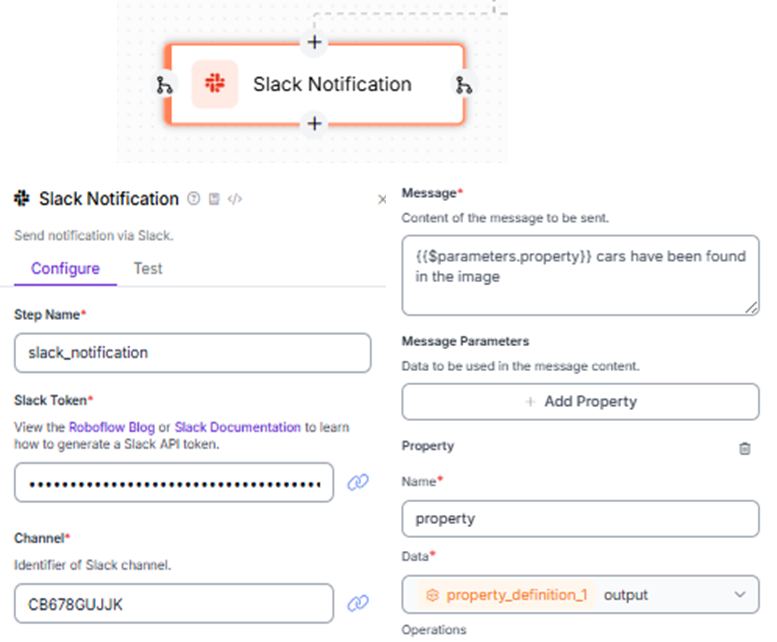
---

## 🪄 Step-by-Step Setup

### 1. Create a Slack Account & Workspace
- Go to [Slack Signup Page](https://slack.com/intl/en-in/get-started#/createnew)  
- Create a new workspace or use an existing one.
- 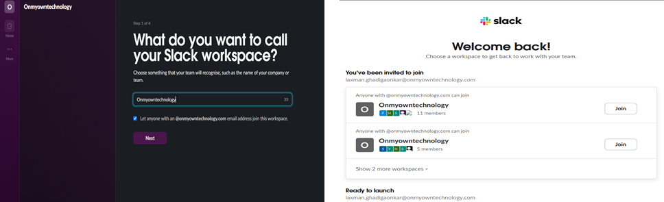
---

### 2. Create a Slack Bot App
- Visit [Slack API Apps](https://api.slack.com/apps?ref=blog.roboflow.com)  
- Click **Create New App → From Scratch**  
- 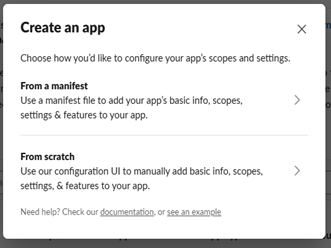
- Provide a **name** for your app.
- 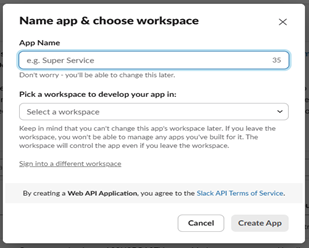
---

### 3. Add Bot Permissions
1. Navigate to **OAuth & Permissions**. 
- 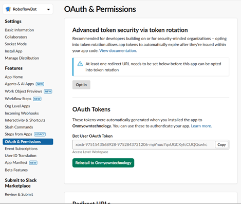
2. Under **Scopes**, add the following OAuth Scopes:
   - `chat:write`
   - `chat:write.public`
   - `files:write`  
  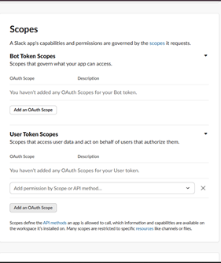
 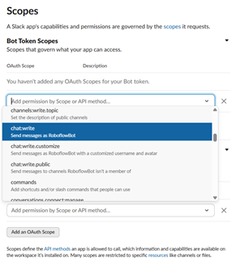
   These permissions allow your bot to send messages and share files in channels.

---

### 4. Generate Bot Token
- Scroll up and click **Install/Reinstall to Workspace**.  
- 
- Copy the **Bot User OAuth Token** shown after installation.  
- This token will be added to your **Roboflow Slack Block** configuration.
- 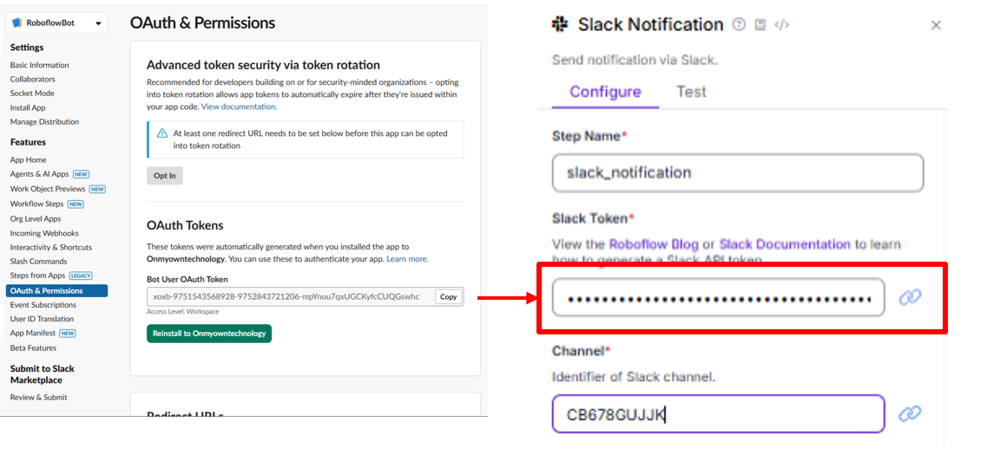

---

### 5. Get Channel ID
- Go to your Slack workspace .
- Select or create a **channel** for notifications.  
- 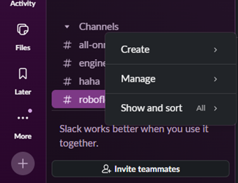
- Click the **three dots → View Channel Details**.  
- 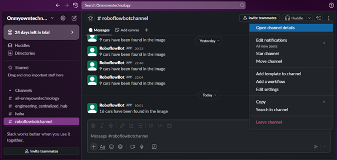
- Scroll down to find the **Channel ID** at the bottom. 
- 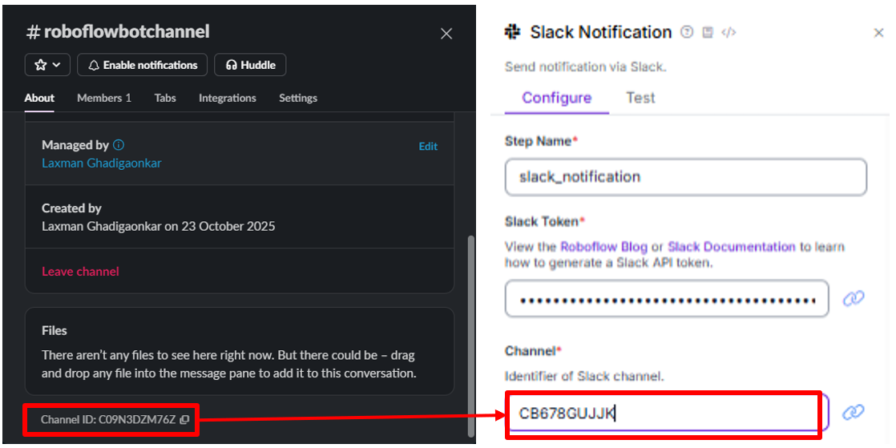 
  → Use this ID in your Slack Block configuration.

---

### 6. Add Bot to Channel
- In the Slack channel, click **Integrations → Add an App**.  
- Select your newly created bot.  
- 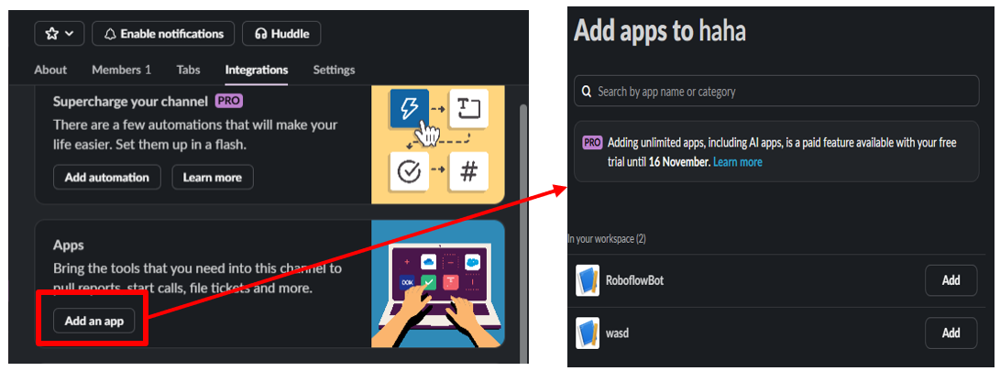
- Once added, it will appear as a **member of the channel** and can send messages.

---

## 💬 Sending Messages
- Add message data in the **Message Parameters** section of the Slack Block.  
- 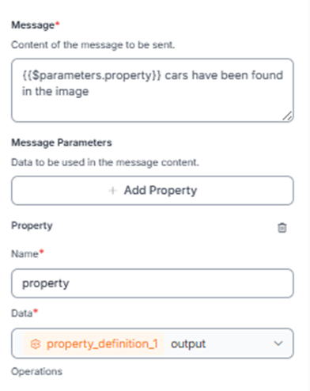  
- Each parameter will have a **name** and **value**.  
- To reference a property from previous steps:
  ```text
  {{$parameters.property_name}}
