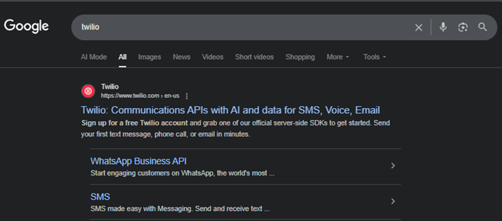
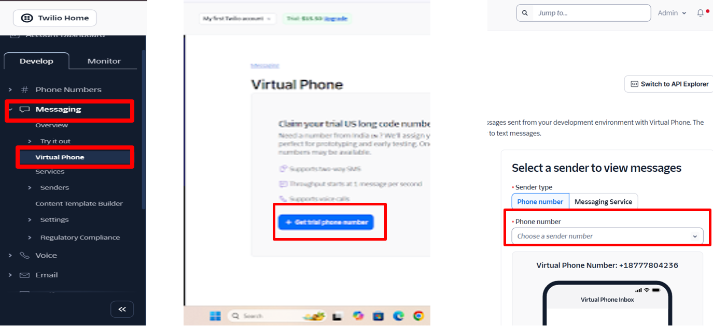
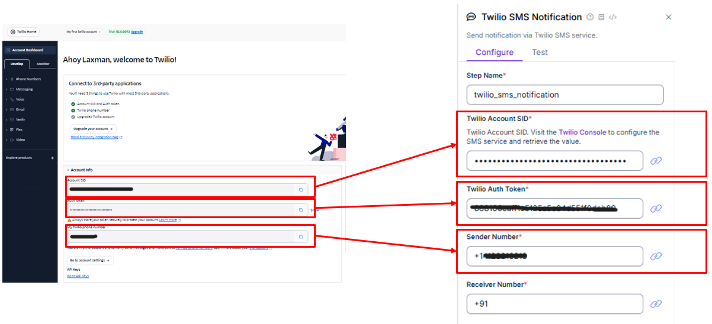
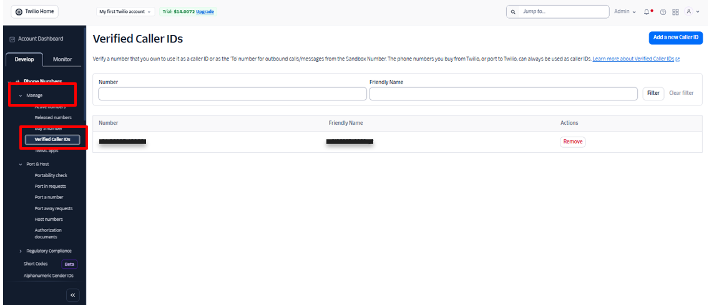

# 📱 Twilio SMS Notification Workflow Integration

## 📘 Overview
The **Twilio SMS Notification Block** allows Roboflow workflows to send SMS alerts directly to verified phone numbers using the **Twilio API**.  
Twilio provides a virtual phone number and secure authentication credentials, enabling you to send automated text messages for workflow updates, predictions, or alerts.

---

## ⚙️ Key Requirements
Before setting up the notification block, you’ll need:
- A **Twilio account**
- A **verified phone number**
- Your **Account SID**
- Your **Auth Token**
- A **Twilio virtual phone number**

These details are used to configure the Twilio block within your Roboflow workflow.

---

## 🪄 Step-by-Step Setup

### 1. Create a Twilio Account
- Go to [Twilio Signup Page](https://www.twilio.com/try-twilio)
--   
- Click **Start for Free**
- Sign in using your **Google account** or create a new one
- Twilio will ask for a **phone number** — this is mandatory  
  → You’ll receive an **OTP** to verify it
---

### 2. Complete Account Setup
- Select options that best describe your use case  
- Once done, Twilio will generate your:
--   
  - **Account SID**
  - **Auth Token**  
--   
These credentials will be required for Roboflow configuration.

---

### 3. Get a Virtual Phone Number
1. In your Twilio Dashboard, navigate to **Messaging → Get a Virtual Phone Number**  
2. Choose your preferred phone number  
3. This number will be used as the **sender ID** for SMS notifications

---

### 4. Verify Recipient Numbers
To send messages, Twilio requires verification of destination numbers.

1. Go to **Messaging → Verified Caller IDs**
--  
2. Check the list of active verified numbers
3. If you want to send SMS to a new number:
   - Add the number under **Verified Caller IDs**
   - Verify it using the OTP sent by Twilio

---

## 💬 Configuring Message Parameters
Similar to other Roboflow notification blocks, Twilio uses **Message Parameters** to customize the content dynamically.

Each parameter has a **name** and **value** pair.

To include values from your workflow in the SMS message:
```text
{{$parameters.property_name}}
